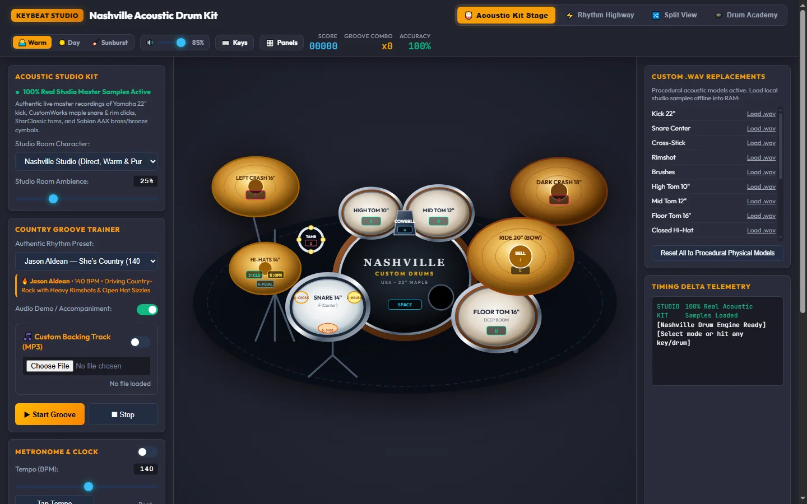

# 🥁 KeyBeat — Nashville Acoustic Drum Studio & Groove Academy

<div align="center">

[-success?style=for-the-badge&logo=javascript&logoColor=F7DF1E)](index.html)
[](https://developer.mozilla.org/en-US/docs/Web/API/Web_Audio_API)
[](index.html)
[-10b981?style=for-the-badge&logo=midi&logoColor=white)](index.html)
[](LICENSE)
[](https://github.com)

<br/>

### 🤠 *Turn Your Laptop Keyboard into a Pro Nashville Country-Rock Drum Kit*

**KeyBeat is a zero-latency acoustic drum studio, 60 FPS rhythm highway, and 10-level touch-typing academy.**  
*Built with pure HTML5, CSS3, Vanilla JavaScript, and the Web Audio API — no frameworks, no build tools, no popups, zero installation.*

[**Live Demo**](#-quick-start) •
[**Core Features**](#-core-features) •
[**Touch-Typing Layout**](#-10-finger-touch-typing-layout) •
[**Drum Academy**](#-nashville-drum-academy) •
[**Audio Architecture**](#-audio-engine--sound-synthesis) •
[**MIDI Export**](#-daw-midi-export-specification) •
[**FAQ**](#-troubleshooting--faq)

<br/><br/>

[](index.html)

</div>

---

## 📑 Table of Contents

- [📖 Overview](#-overview)
- [⚡ Quick Start & Deployment](#-quick-start--deployment)
  - [Instant Browser Play](#1-instant-browser-play)
  - [Local Static Server](#2-local-static-server-recommended)
  - [One-Click GitHub Pages Deployment](#3-one-click-github-pages-deployment)
- [🌟 Core Features](#-core-features)
  - [1. 2.5D Vector Drum Stage](#1-interactive-25d-vector-drum-stage)
  - [2. 60 FPS Rhythm Highway](#2-60-fps-rhythm-highway)
  - [3. Split View Mode](#3-split-view-mode)
  - [4. Country Drummer Dynamics Engine](#4-country-drummer-dynamics-engine)
  - [5. Country Groove Trainer & Custom Tracks](#5-country-groove-trainer--backing-tracks)
- [⌨️ 10-Finger Touch Typing Layout](#️-10-finger-touch-typing-layout)
  - [Ergonomic Philosophy](#ergonomic-philosophy)
  - [Keyboard Diagram](#home-row-tactile-mapping)
  - [Complete Articulation & Key Matrix](#complete-articulation--key-matrix)
- [🎓 Nashville Drum Academy](#-nashville-drum-academy)
  - [10-Level Progressive Curriculum](#10-level-progressive-curriculum)
  - [Interactive Training Cockpit](#interactive-training-cockpit)
- [🔬 Audio Engine & Sound Synthesis](#-audio-engine--sound-synthesis)
  - [Hybrid Sound Generation](#hybrid-sound-generation)
  - [Acoustic Room Convolver](#acoustic-room-convolver)
  - [Custom .WAV Sample Loader](#custom-wav-sample-loader)
- [💾 DAW MIDI Export Specification](#-daw-midi-export-specification)
- [🎨 Visual Studio Themes](#-visual-studio-themes)
- [📂 Project Structure](#-project-structure)
- [🌐 Browser Compatibility](#-browser-compatibility)
- [❓ Troubleshooting & FAQ](#-troubleshooting--faq)
- [📜 License](#-license)

---

## 📖 Overview

**KeyBeat** transforms computer keyboards into expressive, four-limb acoustic drum kits. Traditional virtual instruments cram keys arbitrarily across the keyboard, forcing players to look down at their fingers. 

KeyBeat is built upon **touch-typing ergonomics**:
- Your fingers rest on the universal **Home Row** (<kbd>A</kbd> <kbd>S</kbd> <kbd>D</kbd> <kbd>F</kbd> for the left hand, <kbd>J</kbd> <kbd>K</kbd> <kbd>L</kbd> <kbd>;</kbd> for the right hand).
- Tactile keyboard nubs on <kbd>F</kbd> (Snare) and <kbd>J</kbd> (Closed Hi-Hat) provide blind orientation without looking down.
- Both thumbs naturally strike the <kbd>SPACEBAR</kbd> to drive the 22" acoustic bass drum, emulating the physical motion of a drum kick pedal.

Whether you are practicing Nashville train beats, learning 6/8 country ballads, or laying down real-time MIDI tracks for your digital audio workstation (DAW), KeyBeat provides an instantaneous, low-latency acoustic response right in your browser with **zero popups or modal walls**.

---

## ⚡ Quick Start & Deployment

### 1. Instant Browser Play
1. Clone or download this repository:
   ```bash
   git clone https://github.com/your-username/keybeat.git
   cd keybeat
   ```
2. Double-click **`index.html`** in your file manager to open it in Chrome, Edge, Firefox, Safari, or Brave.
3. The studio loads directly into the main stage — simply tap <kbd>SPACEBAR</kbd> or click any drum piece to begin jamming!

### 2. Local Static Server (Recommended)
Running through a local HTTP server guarantees full access to streaming audio features:

```bash
# Option A: Using Python 3 (built-in on most systems)
python -m http.server 8080

# Option B: Using Node.js npx
npx serve .

# Option C: Using PHP CLI
php -S localhost:8080
```
Open **`http://localhost:8080`** in your browser.

### 3. One-Click GitHub Pages Deployment
Host your studio for free on GitHub Pages:
1. Push this repository to your GitHub account.
2. Navigate to **Settings** > **Pages**.
3. Under **Branch**, select `main` (or `master`) and folder `/ (root)`.
4. Click **Save**. Your drum studio will be live at `https://<username>.github.io/<repo-name>/`!

---

## 🌟 Core Features

### 1. Interactive 2.5D Vector Drum Stage
- Scalable SVG kit rendered with realistic wood shell lacquers, chrome die-cast hoops, and bronze lathe textures.
- Dynamic physical animations:
  - **Cymbal Tilts & Wobbles:** Cymbals pivot on their boom arms when hit.
  - **Resonant Head Shockwaves:** Snare and kick heads generate animated ripple rings proportional to velocity.
  - **Vibration Feedback:** Active hardware elements react visually in real time.

### 2. 60 FPS Rhythm Highway
- Vertical cascading highway engineered with HTML5 Canvas.
- Color-coded note gems aligned with the corresponding instrument lanes.
- Millisecond-precision timing window assessment:
  - 🟢 **PERFECT** (±25ms)
  - 🔵 **GREAT** (±50ms)
  - 🟡 **GOOD** (±80ms)
  - 🔴 **EARLY / LATE**
- Real-time groove combo multipliers and accuracy percentages.

### 3. Split View Mode
- Side-by-side presentation displaying both the 2.5D Stage and the Rhythm Highway simultaneously.
- Ideal for beginners learning to map note highway gems to physical drum positions.

### 4. Country Drummer Dynamics Engine
Take control of algorithmic drum feel with three dedicated studio sliders:
- **Country Swing Ratio (50% – 75%):** Adjusts timing offsets on 16th and 8th notes to dial in straight rock, lazy Nashville shuffles, or bouncy swing grooves.
- **Rebound Ghost Dynamics (0% – 100%):** Simulates stick bounce physics by attenuating velocity on rapid successive strikes.
- **Acoustic Head Variance (0% – 100%):** Injects subtle analog micro-tuning, shell bleed, and strike jitter for human, organic drum sounds.

### 5. Country Groove Trainer & Backing Tracks
- **Authentic Built-in Presets:**
  - 🔥 **Jason Aldean Anthems:** *She's Country* (140 BPM), *Dirt Road Anthem* (128 BPM Half-Time), *My Kinda Party* (105 BPM Arena Rock)
  - 🌟 **Modern Chart Hits:** *Luke Combs – Beer Never Broke My Heart* (77 BPM Stomp), *Chris Stapleton – Tennessee Whiskey* (72 BPM 6/8 Blues Ballad), *Morgan Wallen – Whiskey Glasses* (150 BPM Country-Pop), *Florida Georgia Line – Cruise* (148 BPM Radio Groove)
  - 🤠 **Nashville Traditions:** *Tennessee Train Beat* (Johnny Cash brushes & 16ths), *Texas Half-Time Shuffle*, *Honky-Tonk Two-Step*
- **Custom Backing Track Sync:** Upload any personal `.mp3` or `.wav` song file to practice and jam alongside the rhythm highway.

---

## ⌨️ 10-Finger Touch Typing Layout

### Ergonomic Philosophy
Traditional drum software maps pads to random keys (e.g., numbers `1` to `9`), creating awkward finger reaches. This studio maps standard drum elements to the typing **Home Row**, grouping left-hand articulations on the snare and right-hand articulations on the cymbals.

### Home Row Tactile Mapping

```
 [TAMB]  [COWBELL]      [HIGH TOM] [MID TOM]    [FLOOR TOM]   [FAST CRASH] [DARK CRASH]
  (Q)       (W)            (E)        (R)           (U)            (I)          (O)
   |         |              |          |             |              |            |
+-----+   +-----+        +-----+    +-----+       +-----+        +-----+      +-----+
|  Q  |   |  W  |        |  E  |    |  R  |       |  U  |        |  I  |      |  O  |
+-----+   +-----+        +-----+    +-----+       +-----+        +-----+      +-----+
   Left Hand Reaches           Upper Rack Toms        Right Floor      Crash Cymbals
========================================================================================
+-----+   +-----+   +-----+   +-----+            +-----+   +-----+   +-----+   +-----+
|  A  |   |  S  |   |  D  |   |  F* |            |  J* |   |  K  |   |  L  |   |  ;  |
+-----+   +-----+   +-----+   +-----+            +-----+   +-----+   +-----+   +-----+
|Pinky|   |Ring |   |Mid  |   |Index|            |Index|   |Mid  |   |Ring |   |Pinky|
 [HAT]    [CROSS]   [RIM]     [SNARE]            [HAT]     [OPEN]    [RIDE]    [RIDE]
 [PED]    [STICK]   [SHOT]    [CTR*]             [CLS*]    [HAT]     [BOW]     [BELL]

       LEFT HAND: Snare & Hat Pedal                  RIGHT HAND: Timekeeping Cymbals
                                (* = Home Row Nub)
========================================================================================
                          +--------------------------------+
                          |            SPACEBAR            |
                          +--------------------------------+
                                 THUMBS: 22" BASS DRUM
```

### Complete Articulation & Key Matrix

| Key | Instrument | Finger Assignment | Musical Role & Sound Character |
| :---: | :--- | :--- | :--- |
| <kbd>SPACE</kbd> | **22" Bass Drum** | Left / Right Thumb | Deep acoustic low-end punch with sub-frequency boom |
| <kbd>F</kbd> | **Snare Center** ⦿ | Left Index (*Home Nub*) | Coated maple head strike with crisp snare wire buzz |
| <kbd>D</kbd> | **Snare Rimshot** | Left Middle | Simultaneous head and rim strike for explosive backbeats |
| <kbd>S</kbd> | **Cross-Stick** | Left Ring | Wooden rim click for soft verses and acoustic ballads |
| <kbd>A</kbd> | **Hi-Hat Pedal** | Left Pinky | Foot pedal closure ("chick") for keeping pulse time |
| <kbd>Z</kbd> | **Wire Brushes** | Left Pinky (*Reach ⇣*) | Soft wire brush sweep for traditional country and jazz |
| <kbd>J</kbd> | **Closed Hi-Hat** ⦿ | Right Index (*Home Nub*) | Crisp stick tip strike on closed Sabian bronze cymbals |
| <kbd>K</kbd> | **Open Hi-Hat** | Right Middle | Sizzling half-open hats with automatic pedal choking |
| <kbd>L</kbd> | **22" Ride (Bow)** | Right Ring | Smooth bronze ping with shimmering harmonic wash |
| <kbd>;</kbd> | **22" Ride (Bell)** | Right Pinky | Piercing high-frequency bell accent |
| <kbd>E</kbd> | **10" High Tom** | Left Middle (*Reach ⇡*) | Resonant high rack tom |
| <kbd>R</kbd> | **12" Mid Tom** | Left Index (*Reach ⇡*) | Warm, melodic center rack tom |
| <kbd>U</kbd> | **16" Floor Tom** | Right Index (*Reach ⇡*) | Thunderous low floor tom boom |
| <kbd>I</kbd> | **14" Fast Crash** | Right Middle (*Reach ⇡*) | Rapid-decay explosive accent cymbal |
| <kbd>O</kbd> | **18" Dark Crash** | Right Ring (*Reach ⇡*) | Heavy sustained arena wash cymbal |
| <kbd>W</kbd> | **Mounted Cowbell** | Left Ring (*Reach ⇡*) | Dry, resonant latin/country-rock percussion |
| <kbd>Q</kbd> | **Tambourine** | Left Pinky (*Reach ⇡*) | Bright jingle for driving chorus sections |
| <kbd>M</kbd> | **Metronome Click** | Global Key | Toggle audible quarter-note click track |

---

## 🎓 Nashville Drum Academy

The Drum Academy includes a comprehensive, progressive 10-level training curriculum:

```mermaid
flowchart LR
    subgraph Phase 1: Core Fundamentals
        L1[1. Foundation Backbeat] --> L2[2. Driving 8th-Notes]
        L2 --> L3[3. Cross-Stick Ballad]
    end
    subgraph Phase 2: Limb Independence
        L3 --> L4[4. Open Hat Sizzle]
        L4 --> L5[5. Four-on-the-Floor]
        L5 --> L6[6. Syncopated Kick Push]
    end
    subgraph Phase 3: Nashville Mastery
        L6 --> L7[7. Ride Bell Groove]
        L7 --> L8[8. Texas Shuffle Swing]
        L8 --> L9[9. Tom Cascade Fills]
        L9 --> L10[10. Arena Anthem Virtuoso]
    end
    L10 ==> GRAD([🎓 Master of Laptop Drumming])
```



### Interactive Training Cockpit
Each lesson provides three dedicated learning routines:
1. **🎧 1. Listen Demo:** The virtual instructor performs the rhythm pattern. The on-screen 10-finger keyboard lights up, showing which finger and key triggers each note.
2. **🎯 2. Practice (Your Turn):** Play along with the click track. Real-time telemetry evaluates timing delta and awards up to 3 stars upon completion.
3. **🪜 3. Speed Ladder:** Challenges tempo endurance. Begins at a relaxed pace (50% speed) and increases BPM after each successful measure up to full tempo.
4. **👨‍🏫 Virtual Coach HUD:** Prompts cues, tips, and technique pointers directly above the keyboard.

---

## 🔬 Audio Engine & Sound Synthesis

### Hybrid Sound Generation
To ensure zero loading failures, the application implements a multi-tier fallback architecture:

```
[Trigger Input] 
      │
      ▼
┌───────────────────────────────┐
│ Master .WAV Sample Available? │
└──────────────┬────────────────┘
       Yes     │     No
  ┌────────────┴────────────┐
  ▼                         ▼
[AudioBufferSource]    [Karplus-Strong / Web Audio Synthesis]
  │                     • Snare: Filtered noise + tuned body sine
  │                     • Kick: 120Hz ➔ 38Hz exponential pitch sweep
  │                     • Cymbals: Multi-oscillator metallic cluster
  └────────────┬────────────┘
               ▼
      [Gain Envelope] ──► [Convolver Reverb] ──► [Master Output]
```

1. **Studio Master Audio Buffers:** Base64-encoded acoustic recordings embedded in `audio_samples.js` (Yamaha Maple Kick, CustomWorks Snare, StarClassic Toms, Sabian AAX Cymbals).
2. **Procedural Physical Modeling Fallback:** If sample files are absent, real-time Web Audio API oscillators and noise generators synthesize responsive physical drum sounds.

### Acoustic Room Convolver
- Studio room reverb simulates natural acoustic reflections of a live Nashville drum room.
- Adjustable **Ambience Wet/Dry** slider lets you blend between a dry, punchy isolation booth and an expansive tracking room.

### Custom .WAV Sample Loader
- Replace any kit piece with your own sample files via the **Custom .WAV Replacements** panel.
- Files are parsed directly into memory buffers using `AudioContext.decodeAudioData()`, maintaining complete offline privacy.

---

## 💾 DAW MIDI Export Specification

The session recorder captures all keyboard performances as **Standard MIDI File (SMF Type 0)** binary streams, ready to import into any digital audio workstation.

<details>
<summary><b>Click to expand General MIDI (GM Level 1) Mapping Reference</b></summary>

<br/>

| Instrument | GM Percussion Note | Octave / Pitch | Note Function |
| :--- | :---: | :---: | :--- |
| **Acoustic Bass Drum** | `35` / `36` | B0 / C1 | Kick drum trigger |
| **Side Stick / Cross-Stick** | `37` | C#1 | Rim click |
| **Acoustic Snare** | `38` | D1 | Snare center strike |
| **Snare Rimshot** | `40` | E1 | Snare rimshot accent |
| **Closed Hi-Hat** | `42` | F#1 | Closed cymbal tap |
| **Pedal Hi-Hat** | `44` | G#1 | Foot splash / chick |
| **Open Hi-Hat** | `46` | A#1 | Open cymbal wash |
| **Low Floor Tom** | `41` / `43` | F1 / G1 | 16" Floor tom |
| **Mid Rack Tom** | `45` / `47` | A1 / B1 | 12" Mid tom |
| **High Rack Tom** | `48` / `50` | C2 / D2 | 10" High tom |
| **Crash Cymbal 1** | `49` | C#2 | Left crash |
| **Crash Cymbal 2** | `57` | A2 | Dark right crash |
| **Ride Cymbal (Bow)** | `51` | D#2 | Ride body |
| **Ride Cymbal (Bell)** | `53` | F2 | Ride bell dome |
| **Tambourine** | `54` | F#2 | Hand tambourine |
| **Cowbell** | `56` | G#2 | Mounted cowbell |

</details>

---

## 🎨 Visual Studio Themes

Personalize your workspace with three curated studio themes via the header switcher:

| Theme Name | Preview | Description |
| :--- | :---: | :--- |
| **Warm Amber** *(Default)* | 🌅 | Dark slate palette with warm gold and amber brass accents. Modeled after intimate vintage tracking studios. |
| **Daylight Acoustic** | ☀️ | Bright, clean aesthetic with high contrast and light gray panels. Modeled after modern mastering facilities. |
| **Vintage Sunburst** | 🎸 | Deep walnut and mahogany shades with burnt orange accents. Modeled after classic 1970s acoustic guitar finishes. |

---

## 📂 Project Structure

```
nashville-drum-studio/
│
├── index.html          # Core single-page application
│                       # Contains: UI layout, CSS design system, SVG kit,
│                       # canvas renderer, audio routing, MIDI encoder & academy
│
├── audio_samples.js    # Pre-rendered studio acoustic drum & cymbal audio samples
│
└── README.md           # Documentation and user reference
```

> [!NOTE]
> All styles, SVG vectors, animations, synthesis algorithms, and MIDI builders are packaged into `index.html` and `audio_samples.js` to preserve portable, zero-setup distribution.

---

## 🌐 Browser Compatibility

The studio uses modern Web Standards (Web Audio API, HTML5 Canvas 2D, SVG 1.1, ECMAScript 2020):

| Browser | Support | Recommended Platform |
| :--- | :---: | :--- |
| **Google Chrome** | ✅ **Full** | Windows / macOS / Linux / ChromeOS |
| **Microsoft Edge** | ✅ **Full** | Windows / macOS |
| **Mozilla Firefox** | ✅ **Full** | Windows / macOS / Linux |
| **Apple Safari** | ✅ **Full** | macOS (v14.1+) / iPadOS |
| **Brave / Opera / Vivaldi** | ✅ **Full** | All desktop platforms |

---

## ❓ Troubleshooting & FAQ

### Q: How does audio activation work without a popup?
> Modern web browsers require a user interaction before audio starts (Autoplay Policy). KeyBeat handles this passively and silently: the moment you press any key (like <kbd>SPACEBAR</kbd>) or click any drum piece, the Web Audio Context immediately unlocks and plays with zero delay. No popups or modal walls required!

### Q: How do I achieve the lowest possible audio latency?
> 1. Use wired headphones or external speakers (Bluetooth audio introduces 100–250ms of hardware latency).  
> 2. Close resource-heavy browser tabs or background audio software.  
> 3. Google Chrome and Microsoft Edge generally yield the lowest Web Audio latency buffers on Windows and macOS.

### Q: Can I record grooves directly into my DAW (Ableton, Logic, FL Studio)?
> Yes! Click **"● Record Session"** in the left panel, perform your groove, and click **"💾 Download Standard MIDI (.mid)"**. Drag the resulting `.mid` file onto any virtual drum instrument track in your DAW.

### Q: Can I load my own drum samples?
> Yes! Use the **Custom .WAV Replacements** panel on the right sidebar. Click **"Load .wav"** beside any drum piece to load your own sample file into RAM.

---

## 📜 License

This project is licensed under the **MIT License** — feel free to use, modify, and distribute it for personal, educational, or commercial applications.

---

<div align="center">

Made with ❤️ and 🥁 for musicians, drummers, and coders worldwide.  
*Rest your fingers on the Home Row, hit Space, and make some noise!*

</div>
